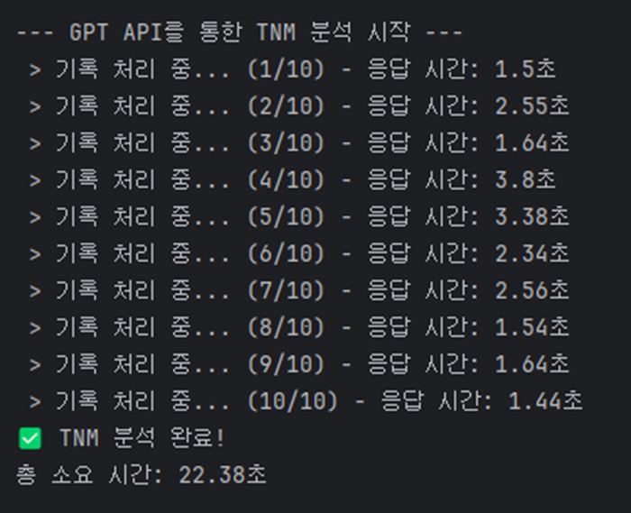

## In-context learning 샘플 수에 따른 성능 비교/분석 
### 개요
In-context learning은 대형 언어 모델이 사전 훈련된 맥락을 이용하여 
새로운 작업을 배우는 능력을 가리킨다.(https://wikidocs.net/237982)

일반적으로 sample 개수가 많을 수록 답변의 품질이 향상(ZERO-shot < ONE-shot < FEW-shot)된다고 한다.
Sample 제공 여부와 개수에 따라 데이터 품질이 얼마나 차이가 있을지 비교, 분석해보고자 한다.

### 실험 환경/데이터
- API: OpenAI API
- Model: gpt-4o
- 언어: Python
- 데이터: 개인정보를 삭제한 병리기록지

### 실험 목적
OpenAI gpt-4o 모델을 활용해 프롬프트 내 예시(sample)의 유무와 개수가 
병리기록지의 TNM Stage 추출 정확도에 미치는 영향을 분석하는 것을 목표로 한다.

### 실험 방법
1. 0개, 1개, 5개의 예시를 제공(문제:병리기록지/정답:TNM Stage)
2. 이전에 제공하지 않은 10개의 새로운 병리기록지의 TNM Stage 추출 요청
3. 제공한 샘플 수 별 정답률, 응답 시간 측정

### 코드
```python
import os
import pandas as pd
from openai import OpenAI
from dotenv import load_dotenv
import json
from pathlib import Path
import sys
import time

load_dotenv()

# OpenAI 클라이언트 초기화
try:
    api_key = os.environ.get("OPENAI_API_KEY")
    if not api_key:
        print("🚨 OpenAI API 키가 설정되지 않았습니다.")
        print("   .env 파일에 'OPENAI_API_KEY=sk-...'를 추가하거나 코드에 직접 입력해주세요.")
        sys.exit()
    client = OpenAI(api_key=api_key)
except Exception as e:
    print(f"🚨 OpenAI 클라이언트 초기화 중 오류 발생: {e}")
    sys.exit()

BASE_PATH = Path("C:/Users/rha00/IdeaProjects/outta")
# 입력 파일과 출력 파일 이름
INPUT_FILENAME = "pathology_records.xlsx"
OUTPUT_FILENAME = "pathology_records_with_tnm_final_ZERO.xlsx"

# 병리기록지 내용이 들어있는 엑셀의 컬럼(열) 이름
PATHOLOGY_COLUMN_NAME = "RECORD"

def analyze_tnm_with_gpt(pathology_text):
    if not isinstance(pathology_text, str) or not pathology_text.strip():
        return {
            "T_stage": "No Text", "N_stage": "No Text", "M_stage": "No Text",
            "overall_stage": "No Text", "evidence": "Input text was empty.",
            "response_time_sec": 0
        }

    system_prompt = f"""
You are a highly specialized medical expert in analyzing pathology reports for colorectal cancer. Your primary task is to accurately extract the TNM staging information from the provided Korean pathology report.

**Your Task:**
Now, analyze the new user-provided pathology report based on the rules and examples above.

1.  **Identify T, N, M stages** from the new report.
2.  **Determine Overall Stage** based on the T, N, and M values.
3.  **Extract Evidence** supporting your findings.

**Final Output Format:**
Respond ONLY with a JSON object in the specified format. Do not add any other text.
"""

    try:
        start_time = time.time()
        analysis_response = client.chat.completions.create(
            model="gpt-4o",
            messages=[
                {"role": "system", "content": system_prompt},
                {"role": "user", "content": pathology_text}
            ],
            response_format={"type": "json_object"},
            temperature=0,
        )
        end_time = time.time()
        response_time = round(end_time - start_time, 2)

        result_json = json.loads(analysis_response.choices[0].message.content)
        result_json['response_time_sec'] = response_time

        return result_json

    except Exception as e:
        print(f"  > API 분석 오류 발생: {e}")
        return {
            "T_stage": "Error", "N_stage": "Error", "M_stage": "Error",
            "overall_stage": "Error", "evidence": str(e),
            "response_time_sec": 0
        }


def main():
    """메인 실행 함수"""
    print("--- TNM 병기 분석 프로그램 시작 (Few-Shot Learning 적용) ---")

    input_file_path = BASE_PATH / INPUT_FILENAME
    if not input_file_path.exists():
        print(f"🚨 파일을 찾을 수 없습니다! 다음 경로를 확인해주세요: {input_file_path}")
        return

    print(f"✅ 입력 파일 확인: {input_file_path}")

    try:
        df = pd.read_excel(input_file_path)
        if PATHOLOGY_COLUMN_NAME not in df.columns:
            print(f"🚨 엑셀 파일에 '{PATHOLOGY_COLUMN_NAME}' 컬럼이 없습니다.")
            print(f"   사용 가능한 컬럼: {list(df.columns)}")
            return
    except Exception as e:
        print(f"🚨 엑셀 파일 로드 중 오류 발생: {e}")
        return

    print(f"✅ 총 {len(df)}개의 병리기록지를 로드했습니다.")
    print("\n--- GPT API를 통한 TNM 분석 시작 ---")

    results_list = []
    total_records = len(df)
    total_start_time = time.time()

    for index, row in df.iterrows():
        pathology_text = row[PATHOLOGY_COLUMN_NAME]
        analysis_result = analyze_tnm_with_gpt(pathology_text)

        time_taken = analysis_result.get('response_time_sec', 0)
        print(f" > 기록 처리 중... ({index + 1}/{total_records}) - 응답 시간: {time_taken}초")

        results_list.append(analysis_result)

    total_end_time = time.time()
    total_elapsed_time = round(total_end_time - total_start_time, 2)

    print("✅ TNM 분석 완료!")
    print(f"총 소요 시간: {total_elapsed_time}초")

    print("\n--- 최종 결과 엑셀 파일로 저장 ---")
    try:
        results_df = pd.DataFrame(results_list)
        if 'evidence' in results_df.columns:
            results_df['evidence'] = results_df['evidence'].astype(str)

        final_df = pd.concat([df, results_df], axis=1)

        output_file_path = BASE_PATH / OUTPUT_FILENAME
        final_df.to_excel(output_file_path, index=False, engine='openpyxl')

        print(f"🎉 모든 작업 완료! 결과가 다음 경로에 저장되었습니다:\n{output_file_path}")

    except Exception as e:
        print(f"🚨 최종 파일 저장 중 오류 발생: {e}")


if __name__ == "__main__":
    main()
```

### 결과
| Shot       | ZERO  | ONE   | FEW   |
| :--------- | :---- | :---- | :---- |
| Sample 수    | 0     | 1     | 5     |
| Sample 토큰 수 | 0     | 616   | 3,118 |
| 걸린 시간    | 43.71 | 20.76 | 22.38 |
| 정답률      | 60%   | 80%   | 90%   |

- zero-shot

- one-shot

- few-shot


### 마치며
프롬프트에 제공된 예시(sample)의 유무가 정답률에 매우 큰 영향을 미치는 것을 확인했다.
예시가 없는 Zero-shot 방식은 One-shot이나 Few-shot에 비해 현저히 낮은 정확도를 보였는데,
이는 궁긍적으로 AI 모델을 최대한 활용하기 위해서는 깊은 도메인 지식이 필요함을 뜻한다고 생각한다.

### 추가 확인이 필요한 사항
#### 1. Zero-shot 방식의 처리 시간이 더 길었던 점
One-shot이나 Few-shot은 명확한 예시와 출력 형식이 주어져 LLM의 추론 경로가 단순화된 반면, 
Zero-shot은 정답의 형태를 처음부터 탐색해야 하므로 더 복잡하고 많은 연산이 필요했기 때문에
더 많은 시간이 걸렸던 것인지,

아니면 반복적인 요청에 대해 OpenAI 내부적으로 캐시데이터를 활용해 
이후의 ONE-SHOT이나 FEW-SHOT 요청을 더 빠르게 처리한 것인가 궁금하다.

#### 2. FEW-SHOT 최적의 샘플 개수
샘플 수가 증가할수록 무조건 답변의 품질이 좋아질까?
너무 많은 샘플이 오히려 언어 모델이 맥락을 파악하는데 어려움을 줘 답변의 품질이 저하될까
그 임계점을 추후에 확인해보고 싶다.

